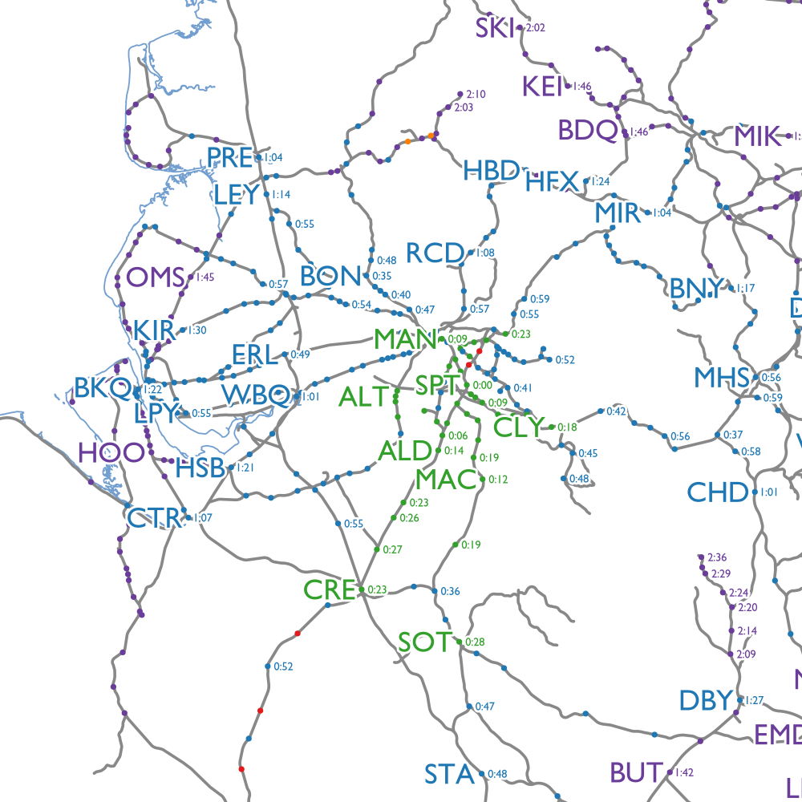
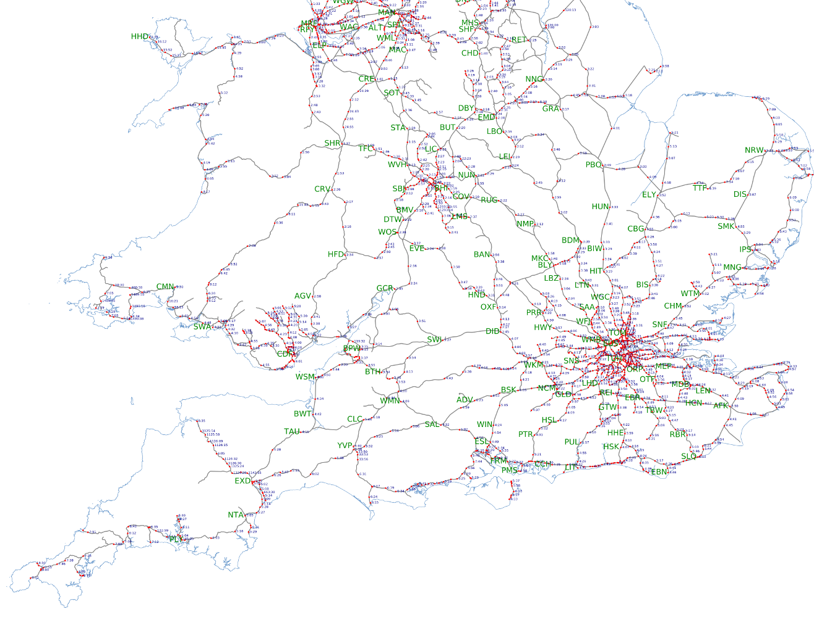

Railmap: Visualising rail travel times in the UK
================================================

This is a quick-and-dirty project to try and visualise how long it takes to get
to any location in the UK rail network starting from a particular location.

Examples
--------

Close up showing distances from Manchester:

Zoomed-out shot of the south of England:

